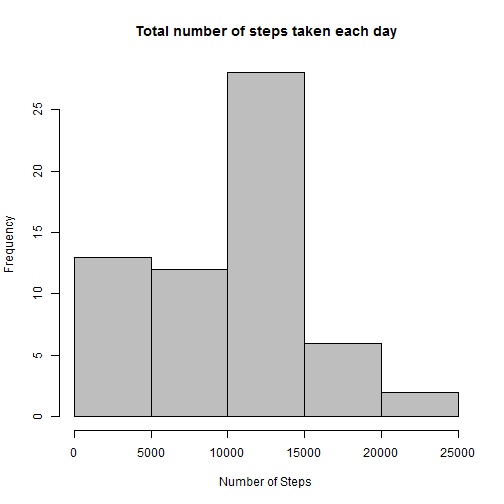
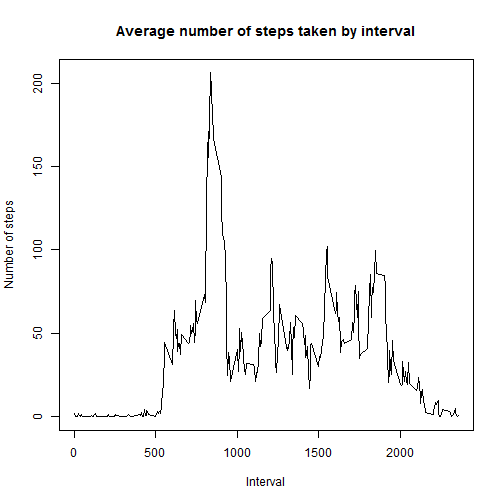
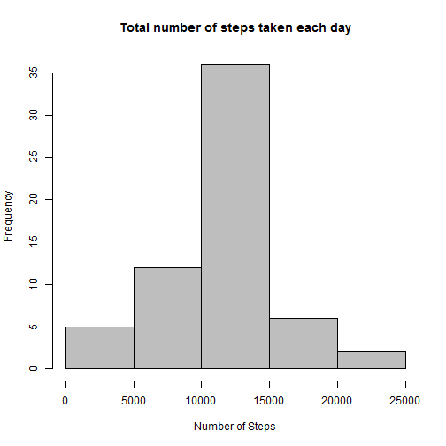
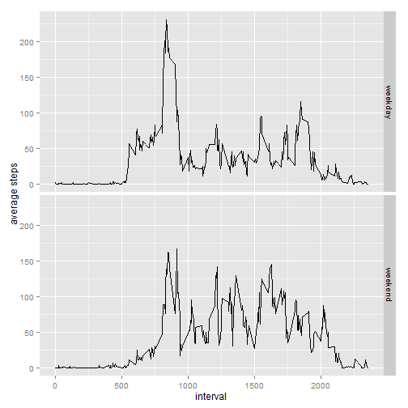

This is my submission for Course Project 1 of the Reproducible Research Coursera course.  Please find my answers for parts 1-9 below.

Please note I used R version 3.2.2 (2015-08-14) -- "Fire Safety"


## 1. Code for reading in the dataset and/or processing the data


```r
# load required libraries
library(dplyr)
library(ggplot2)

# read in activity data
activity_data <- read.csv("activity.csv")
```

## 2. Histogram of the total number of steps taken each day


```r
# Calculate the total number of steps taken per day
          by_date<- group_by(activity_data,date)       # group by date
          steps_per_day<-summarise(by_date,sum(steps,na.rm=TRUE)) # sum of steps
          names(steps_per_day)[2]<-"steps" #rename column
# Create Histogram
          hist(steps_per_day$steps,main="Total number of steps taken each day",
                    xlab = "Number of Steps",col = "gray")
```

 

## 3. Mean and median number of steps taken each day


```r
# Calculate the mean number of steps per day
          mean_steps_per_day <- mean(steps_per_day$steps)
          mean_steps_per_day
```

```
## [1] 9354.23
```

```r
# Calculate the median number of steps per day
          median_steps_per_day<-median(steps_per_day$steps)
          median_steps_per_day
```

```
## [1] 10395
```

## 4. Time series plot of the average number of steps taken


```r
     # Group by interval
          by_interval<-group_by(activity_data,interval)
     # Calculate mean by interval
          mean_by_interval<-summarise(by_interval,mean(steps,na.rm=TRUE))
          names(mean_by_interval)[2]<-"average steps" #rename column
          
     #Create the Time series plot
          plot(mean_by_interval$interval,mean_by_interval$`average steps`,
               type="l",main="Average number of steps taken by interval",
               xlab="Interval",ylab="Number of steps")
```

 

## 5. The 5-minute interval that, on average, contains the maximum number of steps


```r
     # Determine interval with the average max number of steps     
          filter(mean_by_interval,mean_by_interval$`average steps`==
                      max(mean_by_interval$`average steps`))    
```

```
## Source: local data frame [1 x 2]
## 
##   interval average steps
## 1      835      206.1698
```

## 6. Code to describe and show a strategy for imputing missing data
I decided to use the mean for the 5-minute interval to fill in the missing values.  This is because it appears missing values are for entire days, so using the daily mean would result in all 0's.


```r
     # Calculate and report the total number of missing values in the dataset 
          number_of_missing_values<-sum(is.na(activity_data))
          number_of_missing_values   
```

```
## [1] 2304
```

```r
     # Create a new dataset that is equal to the original dataset but with the missing data filled in.
          new<-activity_data %>%
               group_by(interval) %>%
               mutate(steps=ifelse(is.na(steps), mean(steps, na.rm=TRUE),steps))
```

## 7. Histogram of the total number of steps taken each day after missing values are imputed


```r
     # Calculate new number of steps per day given new data set with imputed values
          new_steps_per_day<-new %>%
               group_by(date) %>%
               summarise(sum(steps))
          names(new_steps_per_day)[2]<-"steps"
     # Create Histrogram
          hist(new_steps_per_day$steps,
               main="Total number of steps taken each day",
               xlab = "Number of Steps",col = "gray")
```

 

Calculate and report the mean and median total number of steps taken per day:

```r
     # Calculate the mean number of steps per day including imputed values
          new_mean_steps_per_day <- mean(new_steps_per_day$steps)
          new_mean_steps_per_day
```

```
## [1] 10766.19
```

```r
     # Calculate the median number of steps per day including imputed values
          new_median_steps_per_day<-median(new_steps_per_day$steps)
          new_median_steps_per_day  
```

```
## [1] 10766.19
```

## 8. Panel plot comparing the average number of steps taken per 5-minute interval across weekdays and weekends


```r
     # Create a new factor variable in the dataset with two levels "weekday" and "weekend" indicating whether a given date is a weekday or weekend day.
          weekend_days<-c("Saturday","Sunday")
          #change date to class Date instead of Factor
          new$date<-as.Date(new$date)
          #add new column with Factor variable "weekday" or "weekend"
          new$day<-factor((weekdays(new$date) %in% weekend_days), 
                          levels=c(FALSE,TRUE),labels=c('weekday','weekend'))
          
     # Group by interval and calculate mean number of steps for each interval
          new_by_interval<-group_by(new,day,interval) %>%
               summarise(mean(steps))
          names(new_by_interval)[3]<-"average steps"   # rename column
          
     # Create Panel Plot
          panel_plot<-ggplot(new_by_interval,aes(interval,`average steps`)) + 
               geom_line()
          panel_plot + facet_grid(day ~.)
```

 

## 9. All of the R code needed to reproduce the results (numbers, plots, etc.) in the report

My code has been included above - and also uploaded as a seperate R file "Course_project_1.R"

